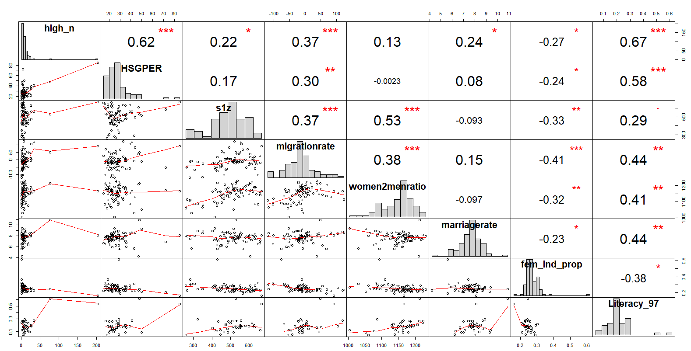
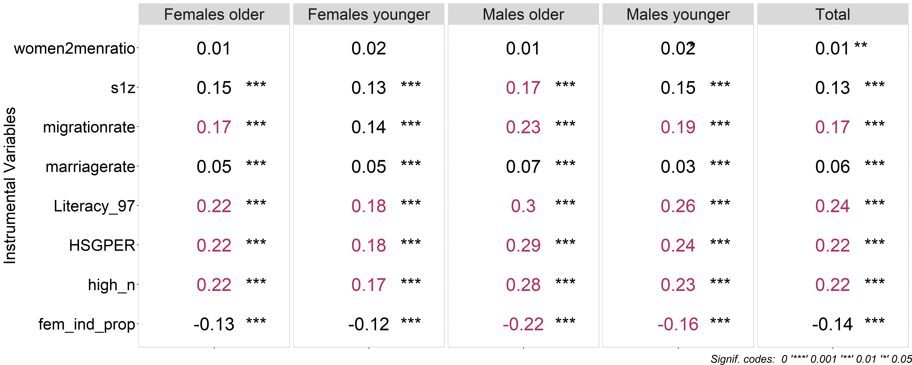
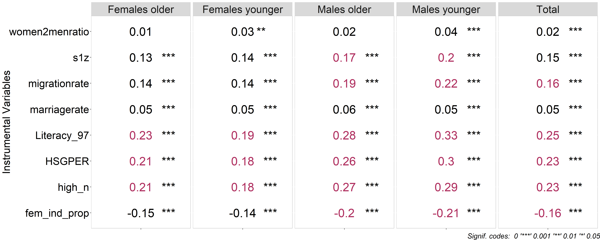
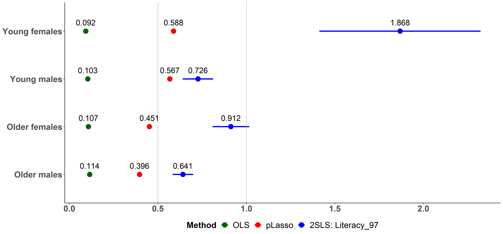

>This notebook shows the main findings from the instrumental variable analysis of the returns to education in the Russian Federation. We tested a number of IVs in separate 2SLS models, using predicted years of education based on the respective instrument in the second stage regression. We utilized 2018 Rosstat and RLMS data in order to capture the most recent labor market situation. We also tested with an earlier year (2015) for which both Rosstat and RLMS data were available, to make sure that the IV results are not an artifact of the year.

 
>Univariate distributions and bivariate correlations between the IVs  are presented in a single matrix as a descriptive table/diagram. OLS results are also presented in a table for reference, the OLS results from the RLMS sample have been presented in WP1. In previous work for this paper, we had analyzed IVs for separate groups of the sample, in order to examine how the results vary across the groups, and we had used post-Lasso IV for the algorithm to select from the set of all instruments. The post-Lasso IV diagrams are also shown.

The instruments of focus are **region-level** aggregates (measurement year is shown in parentheses):

* *HSGPER* - the number of higher education institutions (2015)
* *high_n* - the number high school graduate students per school (2015)
* *s1z* - standard deviations from the national average EGE scores (Russian school-leaving examination) (2014)
* *migrationrate* - net migration rate (2015)
* *women2menratio* - women to men ratio (2015)
* *marriagerate* - marriage rate (2015)
* *FemIndProp* - employment in female-dominated industries (2018)
* *Literacy97* - literacy level in the Russian Empire (1897)

### Descriptives



**Bivariate Correlations between Each of the Instruments and the Schooling**





### Rosstat

The primary purpose of the Rosstat survey (Statistical Survey of Income and Participation in Social Programs) is to obtain statistical information, reflecting the role of wages, income from self-employment, property income, pensions, and social benefits in ensuring people's material well-being. The survey contains data on trends in income and poverty variation among households with different socioeconomic statuses.

The original 2018 sample consisted of 138,219 observations, due to missing values and several filters (individuals aged 25-64 who are out of school and have positive labor market experience and income) the resulting sample embraced 62,957 or 42,623 persons depending on the specification (see Table 1). Table 1 presents the IV results from the Rosstat 2018 sample.

<div style="text-align: right"> *Table 1* </div>
<div align="center">
```{r echo=FALSE, warning=FALSE}
stargazer(ivreg_whole1,
            ivreg_whole2,
            ivreg_whole3,
            ivreg_whole4,
            ivreg_whole5,
            ivreg_whole6,
            ivreg_whole7,
            ivreg_whole8,
            type = "text",
            column.labels = c("highn",
                               "HSGPER", 
                               "s1z", 
                               "migrationrate",
                               "women2menratio",
                               "marriagerate",
                               'FemIndProp',
                               'Literacy97'),
            covariate.labels = c("Education, years",
                                 "Experience",
                                 "Experience squared",
                                 "Constant"),
            title = "RESULTS OF SEPARATE IV ESTIMATION: ROSSTAT 2018",
            dep.var.caption = "Instrument",
            dep.var.labels.include = F,
            df = F,
            ci = F,
            omit.stat = c('rsq', 'adj.rsq'),
            header = F,
            add.lines = list(
              c('Wu-Hausman endogeneity test', 
                round(c(summary(ivreg_whole1, diagnostics = T)$diagnostics['Wu-Hausman','statistic'],
  summary(ivreg_whole2, diagnostics = T)$diagnostics['Wu-Hausman','statistic'],
  summary(ivreg_whole3, diagnostics = T)$diagnostics['Wu-Hausman','statistic'],
  summary(ivreg_whole4, diagnostics = T)$diagnostics['Wu-Hausman','statistic'],
  summary(ivreg_whole5, diagnostics = T)$diagnostics['Wu-Hausman','statistic'],
  summary(ivreg_whole6, diagnostics = T)$diagnostics['Wu-Hausman','statistic'],
  summary(ivreg_whole7, diagnostics = T)$diagnostics['Wu-Hausman','statistic'],
  summary(ivreg_whole8, diagnostics = T)$diagnostics['Wu-Hausman','statistic']),1)),
  c('[p-value]', 
                round(c(summary(ivreg_whole1, diagnostics = T)$diagnostics['Wu-Hausman','p-value'],
  summary(ivreg_whole2, diagnostics = T)$diagnostics['Wu-Hausman','p-value'],
  summary(ivreg_whole3, diagnostics = T)$diagnostics['Wu-Hausman','p-value'],
  summary(ivreg_whole4, diagnostics = T)$diagnostics['Wu-Hausman','p-value'],
  summary(ivreg_whole5, diagnostics = T)$diagnostics['Wu-Hausman','p-value'],
  summary(ivreg_whole6, diagnostics = T)$diagnostics['Wu-Hausman','p-value'],
  summary(ivreg_whole7, diagnostics = T)$diagnostics['Wu-Hausman','p-value'],
  summary(ivreg_whole8, diagnostics = T)$diagnostics['Wu-Hausman','p-value']),3)),
  c('F test', 
                round(c(summary(ivreg_whole1, diagnostics = T)$diagnostics['Wu-Hausman','statistic'],
  summary(ivreg_whole2, diagnostics = T)$diagnostics['Weak instruments','statistic'],
  summary(ivreg_whole3, diagnostics = T)$diagnostics['Weak instruments','statistic'],
  summary(ivreg_whole4, diagnostics = T)$diagnostics['Weak instruments','statistic'],
  summary(ivreg_whole5, diagnostics = T)$diagnostics['Weak instruments','statistic'],
  summary(ivreg_whole6, diagnostics = T)$diagnostics['Weak instruments','statistic'],
  summary(ivreg_whole7, diagnostics = T)$diagnostics['Weak instruments','statistic'],
  summary(ivreg_whole8, diagnostics = T)$diagnostics['Weak instruments','statistic']),3)),
  c('[p-value]', 
                round(c(summary(ivreg_whole1, diagnostics = T)$diagnostics['Weak instruments','p-value'],
  summary(ivreg_whole2, diagnostics = T)$diagnostics['Weak instruments','p-value'],
  summary(ivreg_whole3, diagnostics = T)$diagnostics['Weak instruments','p-value'],
  summary(ivreg_whole4, diagnostics = T)$diagnostics['Weak instruments','p-value'],
  summary(ivreg_whole5, diagnostics = T)$diagnostics['Weak instruments','p-value'],
  summary(ivreg_whole6, diagnostics = T)$diagnostics['Weak instruments','p-value'],
  summary(ivreg_whole7, diagnostics = T)$diagnostics['Weak instruments','p-value'],
  summary(ivreg_whole8, diagnostics = T)$diagnostics['Weak instruments','p-value']),3))
            )
  )
```

</div>
### RLMS

Out of 23 waves of RLMS data available, we used the latest one, collected in 2018, to preserve consistency with Rosstat estimates. The initial sample size was equal to 18,234 observations, the final dataset for the analysis embraced 6,112 or 4,294 individuals depending on a specification. Table 2 presents the IV results from the RLMS 2018 sample.

<div style="text-align: right"> *Table 2* </div>
<div align="center">
```{r echo=FALSE, warning=FALSE}
stargazer(RLMS_ivreg_whole1,
            RLMS_ivreg_whole2,
            RLMS_ivreg_whole3,
            RLMS_ivreg_whole4,
            RLMS_ivreg_whole5,
            RLMS_ivreg_whole6,
            RLMS_ivreg_whole7,
            RLMS_ivreg_whole8,
            type = "text",
            column.labels = c("highn",
                               "HSGPER", 
                               "s1z", 
                               "migrationrate",
                               "women2menratio",
                               "marriagerate",
                               'FemIndProp',
                               'Literacy97'),
            covariate.labels = c("Education, years",
                                 "Experience",
                                 "Experience squared",
                                 "Constant"),
            title = "RESULTS OF SEPARATE IV ESTIMATION: RLMS 2018",
            dep.var.caption = "Instrument",
            dep.var.labels.include = F,
            df = F,
            ci = F,
            omit.stat = c('rsq', 'adj.rsq'),
            header = F,
            add.lines = list(
              c('Wu-Hausman endogeneity test', 
                round(c(summary(RLMS_ivreg_whole1, diagnostics = T)$diagnostics['Wu-Hausman','statistic'],
  summary(RLMS_ivreg_whole2, diagnostics = T)$diagnostics['Wu-Hausman','statistic'],
  summary(RLMS_ivreg_whole3, diagnostics = T)$diagnostics['Wu-Hausman','statistic'],
  summary(RLMS_ivreg_whole4, diagnostics = T)$diagnostics['Wu-Hausman','statistic'],
  summary(RLMS_ivreg_whole5, diagnostics = T)$diagnostics['Wu-Hausman','statistic'],
  summary(RLMS_ivreg_whole6, diagnostics = T)$diagnostics['Wu-Hausman','statistic'],
  summary(RLMS_ivreg_whole7, diagnostics = T)$diagnostics['Wu-Hausman','statistic'],
  summary(RLMS_ivreg_whole8, diagnostics = T)$diagnostics['Wu-Hausman','statistic']),1)),
  c('[p-value]', 
                round(c(summary(RLMS_ivreg_whole1, diagnostics = T)$diagnostics['Wu-Hausman','p-value'],
  summary(RLMS_ivreg_whole2, diagnostics = T)$diagnostics['Wu-Hausman','p-value'],
  summary(RLMS_ivreg_whole3, diagnostics = T)$diagnostics['Wu-Hausman','p-value'],
  summary(RLMS_ivreg_whole4, diagnostics = T)$diagnostics['Wu-Hausman','p-value'],
  summary(RLMS_ivreg_whole5, diagnostics = T)$diagnostics['Wu-Hausman','p-value'],
  summary(RLMS_ivreg_whole6, diagnostics = T)$diagnostics['Wu-Hausman','p-value'],
  summary(RLMS_ivreg_whole7, diagnostics = T)$diagnostics['Wu-Hausman','p-value'],
  summary(RLMS_ivreg_whole8, diagnostics = T)$diagnostics['Wu-Hausman','p-value']),3))
  ,
  c('F test', 
                round(c(summary(RLMS_ivreg_whole1, diagnostics = T)$diagnostics['Wu-Hausman','statistic'],
  summary(RLMS_ivreg_whole2, diagnostics = T)$diagnostics['Weak instruments','statistic'],
  summary(RLMS_ivreg_whole3, diagnostics = T)$diagnostics['Weak instruments','statistic'],
  summary(RLMS_ivreg_whole4, diagnostics = T)$diagnostics['Weak instruments','statistic'],
  summary(RLMS_ivreg_whole5, diagnostics = T)$diagnostics['Weak instruments','statistic'],
  summary(RLMS_ivreg_whole6, diagnostics = T)$diagnostics['Weak instruments','statistic'],
  summary(RLMS_ivreg_whole7, diagnostics = T)$diagnostics['Weak instruments','statistic'],
  summary(RLMS_ivreg_whole8, diagnostics = T)$diagnostics['Weak instruments','statistic']),3)),
  c('[p-value]', 
                round(c(summary(RLMS_ivreg_whole1, diagnostics = T)$diagnostics['Weak instruments','p-value'],
  summary(RLMS_ivreg_whole2, diagnostics = T)$diagnostics['Weak instruments','p-value'],
  summary(RLMS_ivreg_whole3, diagnostics = T)$diagnostics['Weak instruments','p-value'],
  summary(RLMS_ivreg_whole4, diagnostics = T)$diagnostics['Weak instruments','p-value'],
  summary(RLMS_ivreg_whole5, diagnostics = T)$diagnostics['Weak instruments','p-value'],
  summary(RLMS_ivreg_whole6, diagnostics = T)$diagnostics['Weak instruments','p-value'],
  summary(RLMS_ivreg_whole7, diagnostics = T)$diagnostics['Weak instruments','p-value'],
  summary(RLMS_ivreg_whole8, diagnostics = T)$diagnostics['Weak instruments','p-value']),3))
            ))
```

</div>

### 2015 Estimates

### Rosstat

Table 3 presents the IV results from the Rosstat 2015 sample.

<div style="text-align: right"> *Table 3* </div>
<div align="center">
```{r echo=FALSE, warning=FALSE}
stargazer(ivreg_whole1_15,
            ivreg_whole2_15,
            ivreg_whole3_15,
            ivreg_whole4_15,
            ivreg_whole5_15,
            ivreg_whole6_15,
            ivreg_whole7_15,
            ivreg_whole8_15,
            type = "text",
            column.labels = c("highn",
                               "HSGPER", 
                               "s1z", 
                               "migrationrate",
                               "women2menratio",
                               "marriagerate",
                               'FemIndProp',
                               'Literacy97'),
            covariate.labels = c("Education, years",
                                 "Experience",
                                 "Experience squared",
                                 "Constant"),
            title = "RESULTS OF SEPARATE IV ESTIMATION: ROSSTAT 2015",
            dep.var.caption = "Instrument",
            dep.var.labels.include = F,
            df = F,
            ci = F,
            omit.stat = c('rsq', 'adj.rsq'),
            header = F,
            add.lines = list(
              c('Wu-Hausman endogeneity test', 
                round(c(summary(ivreg_whole1_15, diagnostics = T)$diagnostics['Wu-Hausman','statistic'],
  summary(ivreg_whole2_15, diagnostics = T)$diagnostics['Wu-Hausman','statistic'],
  summary(ivreg_whole3_15, diagnostics = T)$diagnostics['Wu-Hausman','statistic'],
  summary(ivreg_whole4_15, diagnostics = T)$diagnostics['Wu-Hausman','statistic'],
  summary(ivreg_whole5_15, diagnostics = T)$diagnostics['Wu-Hausman','statistic'],
  summary(ivreg_whole6_15, diagnostics = T)$diagnostics['Wu-Hausman','statistic'],
  summary(ivreg_whole7_15, diagnostics = T)$diagnostics['Wu-Hausman','statistic'],
  summary(ivreg_whole8_15, diagnostics = T)$diagnostics['Wu-Hausman','statistic']),1)),
  c('[p-value]', 
                round(c(summary(ivreg_whole1, diagnostics = T)$diagnostics['Wu-Hausman','p-value'],
  summary(ivreg_whole1_15, diagnostics = T)$diagnostics['Wu-Hausman','p-value'],
  summary(ivreg_whole2_15, diagnostics = T)$diagnostics['Wu-Hausman','p-value'],
  summary(ivreg_whole3_15, diagnostics = T)$diagnostics['Wu-Hausman','p-value'],
  summary(ivreg_whole4_15, diagnostics = T)$diagnostics['Wu-Hausman','p-value'],
  summary(ivreg_whole5_15, diagnostics = T)$diagnostics['Wu-Hausman','p-value'],
  summary(ivreg_whole6_15, diagnostics = T)$diagnostics['Wu-Hausman','p-value'],
  summary(ivreg_whole7_15, diagnostics = T)$diagnostics['Wu-Hausman','p-value']),3))
  ,
  c('F test', 
                round(c(summary(ivreg_whole1_15, diagnostics = T)$diagnostics['Wu-Hausman','statistic'],
  summary(ivreg_whole2_15, diagnostics = T)$diagnostics['Weak instruments','statistic'],
  summary(ivreg_whole3_15, diagnostics = T)$diagnostics['Weak instruments','statistic'],
  summary(ivreg_whole4_15, diagnostics = T)$diagnostics['Weak instruments','statistic'],
  summary(ivreg_whole5_15, diagnostics = T)$diagnostics['Weak instruments','statistic'],
  summary(ivreg_whole6_15, diagnostics = T)$diagnostics['Weak instruments','statistic'],
  summary(ivreg_whole7_15, diagnostics = T)$diagnostics['Weak instruments','statistic'],
  summary(ivreg_whole8_15, diagnostics = T)$diagnostics['Weak instruments','statistic']),3)),
  c('[p-value]', 
                round(c(summary(ivreg_whole1_15, diagnostics = T)$diagnostics['Weak instruments','p-value'],
  summary(ivreg_whole2_15, diagnostics = T)$diagnostics['Weak instruments','p-value'],
  summary(ivreg_whole3_15, diagnostics = T)$diagnostics['Weak instruments','p-value'],
  summary(ivreg_whole4_15, diagnostics = T)$diagnostics['Weak instruments','p-value'],
  summary(ivreg_whole5_15, diagnostics = T)$diagnostics['Weak instruments','p-value'],
  summary(ivreg_whole6_15, diagnostics = T)$diagnostics['Weak instruments','p-value'],
  summary(ivreg_whole7_15, diagnostics = T)$diagnostics['Weak instruments','p-value'],
  summary(ivreg_whole8_15, diagnostics = T)$diagnostics['Weak instruments','p-value']),3))
            ))
```

</div>

### RLMS

Table 4 presents the IV results from the RLMS 2015 sample.

<div style="text-align: right"> *Table 4* </div>
<div align="center">
```{r echo=FALSE, warning=FALSE}
stargazer(RLMS_ivreg_whole1_15,
            RLMS_ivreg_whole2_15,
            RLMS_ivreg_whole3_15,
            RLMS_ivreg_whole4_15,
            RLMS_ivreg_whole5_15,
            RLMS_ivreg_whole6_15,
            RLMS_ivreg_whole7_15,
            RLMS_ivreg_whole8_15,
            type = "text",
            column.labels = c("highn",
                               "HSGPER", 
                               "s1z", 
                               "migrationrate",
                               "women2menratio",
                               "marriagerate",
                               'FemIndProp',
                               'Literacy97'),
            covariate.labels = c("Education, years",
                                 "Experience",
                                 "Experience squared",
                                 "Constant"),
            title = "RESULTS OF SEPARATE IV ESTIMATION: RLMS 2015",
            dep.var.caption = "Instrument",
            dep.var.labels.include = F,
            df = F,
            ci = F,
            omit.stat = c('rsq', 'adj.rsq'),
            header = F,
            add.lines = list(
              c('Wu-Hausman endogeneity test', 
                round(c(summary(RLMS_ivreg_whole1_15, diagnostics = T)$diagnostics['Wu-Hausman','statistic'],
  summary(RLMS_ivreg_whole2_15, diagnostics = T)$diagnostics['Wu-Hausman','statistic'],
  summary(RLMS_ivreg_whole3_15, diagnostics = T)$diagnostics['Wu-Hausman','statistic'],
  summary(RLMS_ivreg_whole4_15, diagnostics = T)$diagnostics['Wu-Hausman','statistic'],
  summary(RLMS_ivreg_whole5_15, diagnostics = T)$diagnostics['Wu-Hausman','statistic'],
  summary(RLMS_ivreg_whole6_15, diagnostics = T)$diagnostics['Wu-Hausman','statistic'],
  summary(RLMS_ivreg_whole7_15, diagnostics = T)$diagnostics['Wu-Hausman','statistic'],
  summary(RLMS_ivreg_whole8_15, diagnostics = T)$diagnostics['Wu-Hausman','statistic']),1)),
  c('[p-value]', 
                round(c(summary(RLMS_ivreg_whole1_15, diagnostics = T)$diagnostics['Wu-Hausman','p-value'],
  summary(RLMS_ivreg_whole2_15, diagnostics = T)$diagnostics['Wu-Hausman','p-value'],
  summary(RLMS_ivreg_whole3_15, diagnostics = T)$diagnostics['Wu-Hausman','p-value'],
  summary(RLMS_ivreg_whole4_15, diagnostics = T)$diagnostics['Wu-Hausman','p-value'],
  summary(RLMS_ivreg_whole5_15, diagnostics = T)$diagnostics['Wu-Hausman','p-value'],
  summary(RLMS_ivreg_whole6_15, diagnostics = T)$diagnostics['Wu-Hausman','p-value'],
  summary(RLMS_ivreg_whole7_15, diagnostics = T)$diagnostics['Wu-Hausman','p-value'],
  summary(RLMS_ivreg_whole8_15, diagnostics = T)$diagnostics['Wu-Hausman','p-value']),3))
  ,
  c('F test', 
                round(c(summary(RLMS_ivreg_whole1_15, diagnostics = T)$diagnostics['Wu-Hausman','statistic'],
  summary(RLMS_ivreg_whole2_15, diagnostics = T)$diagnostics['Weak instruments','statistic'],
  summary(RLMS_ivreg_whole3_15, diagnostics = T)$diagnostics['Weak instruments','statistic'],
  summary(RLMS_ivreg_whole4_15, diagnostics = T)$diagnostics['Weak instruments','statistic'],
  summary(RLMS_ivreg_whole5_15, diagnostics = T)$diagnostics['Weak instruments','statistic'],
  summary(RLMS_ivreg_whole6_15, diagnostics = T)$diagnostics['Weak instruments','statistic'],
  summary(RLMS_ivreg_whole7_15, diagnostics = T)$diagnostics['Weak instruments','statistic'],
  summary(RLMS_ivreg_whole8_15, diagnostics = T)$diagnostics['Weak instruments','statistic']),3)),
  c('[p-value]', 
                round(c(summary(RLMS_ivreg_whole1_15, diagnostics = T)$diagnostics['Weak instruments','p-value'],
  summary(RLMS_ivreg_whole2_15, diagnostics = T)$diagnostics['Weak instruments','p-value'],
  summary(RLMS_ivreg_whole3_15, diagnostics = T)$diagnostics['Weak instruments','p-value'],
  summary(RLMS_ivreg_whole4_15, diagnostics = T)$diagnostics['Weak instruments','p-value'],
  summary(RLMS_ivreg_whole5_15, diagnostics = T)$diagnostics['Weak instruments','p-value'],
  summary(RLMS_ivreg_whole6_15, diagnostics = T)$diagnostics['Weak instruments','p-value'],
  summary(RLMS_ivreg_whole7_15, diagnostics = T)$diagnostics['Weak instruments','p-value'],
  summary(RLMS_ivreg_whole8_15, diagnostics = T)$diagnostics['Weak instruments','p-value']),3))
            ))
```

</div>

### OLS

Table 5 presents the OLS results from the Rosstat and RLMS 2018 and 2015 samples.

<div style="text-align: right"> *Table 5* </div>

<div align="center">
```{r echo=FALSE, message=FALSE, warning=FALSE}
stargazer(RLMS_ols_whole_18,
            RLMS_ols_whole_15,
            Rosstat_ols_whole_15,
            Rosstat_ols_whole_18,
            type = "text",
            column.labels = c("RLMS 2018",
                               "RLMS 2015", 
                               "Rosstat 2018", 
                               "Rosstat 2015"),
            covariate.labels = c("Education, years",
                                 "Experience",
                                 "Experience squared",
                                 "Constant"),
            title = "RESULTS OF OLS ESTIMATION",
            dep.var.caption = "Sample",
            dep.var.labels.include = F,
            df = F,
            ci = F,
            omit.stat = c('rsq', 'adj.rsq'),
            header = F)
```
</div>

```{r message=FALSE, warning=FALSE, include=FALSE}
OLS_TSLS_coefs_est <- as.data.frame(round(rbind(
  RLMS_ols_whole_18$coefficients['edu_yrs'],
            RLMS_ols_whole_15$coefficients['edu_yrs'],
            Rosstat_ols_whole_18$coefficients['edu_yrs'],
            Rosstat_ols_whole_15$coefficients['edu_yrs'],
            ivreg_whole1$coefficients['edu_yrs'],
            RLMS_ivreg_whole1$coefficients['edu_yrs'],
            ivreg_whole1_15$coefficients['edu_yrs'],
            RLMS_ivreg_whole1_15$coefficients['edu_yrs']), 3))
OLS_TSLS_coefs_ci <-as.data.frame(rbind(round(confint(RLMS_ols_whole_18)['edu_yrs',], 3),
                           round(confint(RLMS_ols_whole_15)['edu_yrs',], 3),
                           round(confint(Rosstat_ols_whole_18)['edu_yrs',], 3),
                           round(confint(Rosstat_ols_whole_15)['edu_yrs',], 3),
                           round(confint(ivreg_whole1)['edu_yrs',], 3),
                           round(confint(RLMS_ivreg_whole1)['edu_yrs',], 3),
                           round(confint(ivreg_whole1_15)['edu_yrs',], 3),
                           round(confint(RLMS_ivreg_whole1_15)['edu_yrs',], 3)))
OLS_TSLS_coefs <- cbind(OLS_TSLS_coefs_est, OLS_TSLS_coefs_ci)
OLS_TSLS_coefs$Method <- c("OLS", 'OLS', "OLS", 'OLS', "TSLS", "TSLS", "TSLS", "TSLS")
OLS_TSLS_coefs$Year <- c("2018", '2015', "2018", "2015", '2018', '2018', '2015', '2015')
OLS_TSLS_coefs$Sample <- c("RLMS", 'RLMS', "Rosstat", "Rosstat",
                           'Rosstat', 'RLMS', 'Rosstat', 'RLMS')

OLS_TSLS_coefs$Year_Sample <- paste0(OLS_TSLS_coefs$Sample, '_', OLS_TSLS_coefs$Year)
names(OLS_TSLS_coefs)[c(2,3)] <- c('lower', 'upper')
```

The graph below displays returns to education estimates and 95\% CIs for OLS and TSLS. For illustrative purposes we show the estimates only for a signle TSLS model with the number high school graduate students per school (high_n) as an IV.

```{r echo=FALSE, fig.height=4, fig.width=10}
ggplot(OLS_TSLS_coefs,
       aes(y = Year_Sample)) + 
  geom_errorbar(aes(xmin = lower, xmax = upper, color = Method),
                width = 0, size = 1) + 
  scale_color_manual(values = c('darkgreen', 'blue'), 
                     labels = c('OLS', 'TSLS')) +
  geom_point(aes(x = edu_yrs, color = Method), size = 3,
             stroke = 1) + 
  scale_fill_manual(values = c('darkgreen', 'blue'), 
                    labels = c('OLS', 'TSLS'), guide = 'none') +
  theme(panel.background = element_blank(),
        axis.title = element_blank(),
        axis.text = element_text(size = 10, face = 'bold'), 
        axis.line = element_line(color = 'black'),
        plot.title.position = 'plot',
        legend.position = 'bottom') +
 # ggtitle('the % of voc ed as final level amongst women 25-64')+
  geom_vline(xintercept = c(0.4, 0.8), color = 'grey')
```

The following graph reflects estimates of returns to education and 95\% CIs for post-Lasso, TSLS, and OLS by cohorts that were obtained on a 2018 Rosstat sample in our earlier work.


